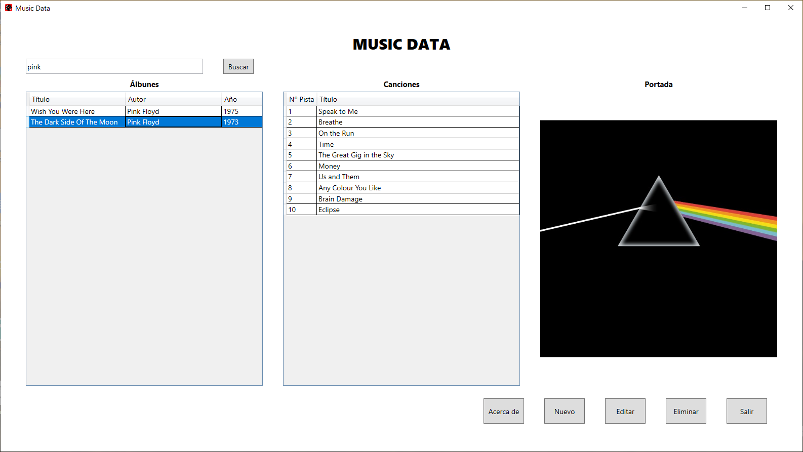
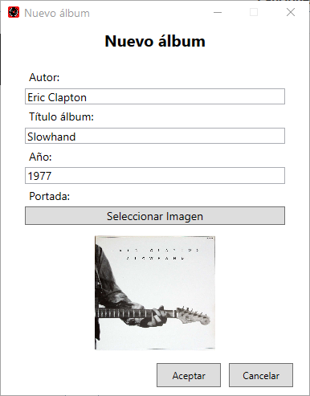
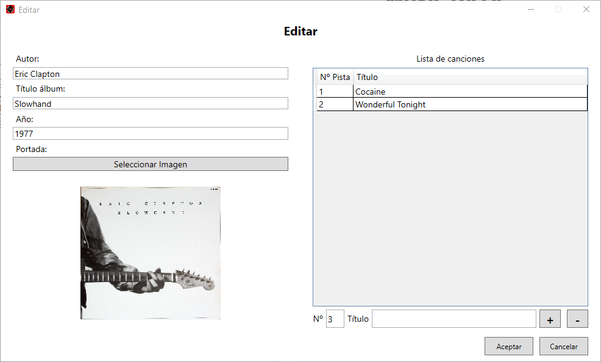
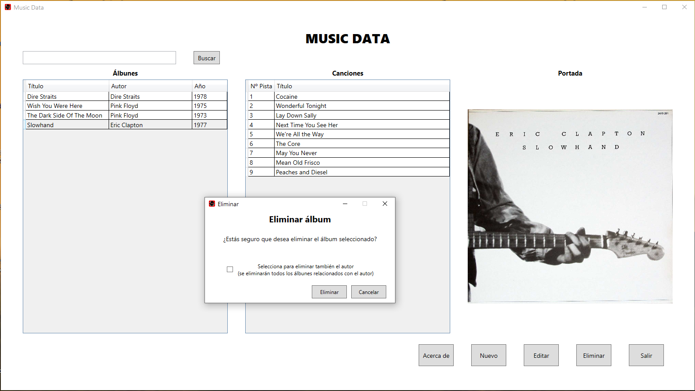

# Music Data
Base de datos para discos musicales

Se trata de un software que nos permite crear una base de datos para discos musicales, está construido con WPF, utilizando como base de datos SQL Server
y gestionada mediante LINQ.

Pantalla principal:

Incluye la vista general de los álbunes (datos de álbum, lista de canciones y portada), todas las opciones para gestionar los datos y un cuadro de búsqueda (con 
posibilidad de buscar por autor, álbum o año).

Agregar nuevo álbum:

Editar álbum/agregar canciones:

Es posible editar todos los datos del álbum y agregar/eliminar canciones.

Eliminar un álbum o un autor completo (Todos los álbunes):

